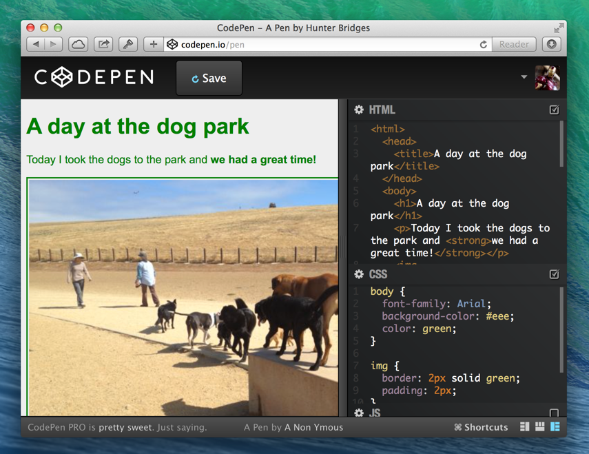
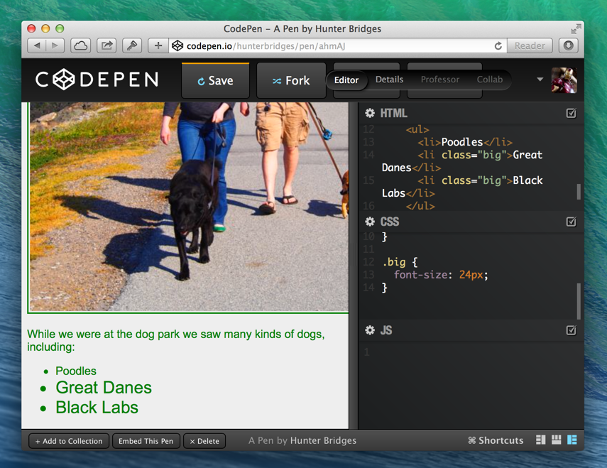

# Build a web page, Lesson 2 – Design and CSS

## Overview

Today's lesson is about
[Cascading Style Sheets](http://en.wikipedia.org/wiki/CSS),
more commonly known as CSS. We are going to use CSS to improve the _look
and feel_ of our stories.

### What is CSS?

CSS is a language that can be used to describe how HTML is supposed to look.
The important distinction here is that HTML structures the content,
while CSS controls how it looks.

Let's look at the difference. Here's the CSS from @jonmagic's story last week:

```css
body {
  font-family: Arial;
  background-color: #eee;
  color: green;
}

img {
  border: 2px solid green;
  padding: 2px;
}
```

And the HTML:

```html
<!DOCTYPE html>
<html>
  <head>
    <title>A day at the dog park</title>
  </head>
  <body>
    <h1>A day at the dog park</h1>
    <p>Today I took the dogs to the park and <strong>we had a great time!</strong></p>
    
    <p>After the dogs played with their friends <em>we took a walk around the track together.</em></p>
    
    <p>While we were at the dog park we saw many kinds of dogs, including:</p>
    <ul>
      <li>Poodles</li>
      <li>Great Danes</li>
      <li>Black Labs</li>
    </ul>
  </body>
</html>
```

When we combine them using CodePen, we get a page that looks like this:



### How CSS Works

We can get an idea of what's happening by looking at each line of the CSS.

* For any ```<body>``` tags
    1. Use ```Arial``` as the font
    2. Set the background color to ```#eee``` (A ***hex color***)
    3. Set the foreground color to ```green```
* For any `````` tags
    1. Give it a ```2px``` wide, ```solid``` border and color it ```green```
    2. Give it ```2px``` of ***padding***

> ***hex color*** - A way to describe colors using
> [hex code](http://en.wikipedia.org/wiki/Hexadecimal). This is used a lot in
> CSS because it allows more specific color selection than just ```blue``` or
> ```green```. A hex color mixes red, green, and blue components. In CSS code,
> a hex color looks kind of like ```#RRGGBB``` or ```#RGB```. Using CodePen,
> we can press Alt to bring up a color picker that can help us find hex color
> codes.

Notice how we are modifying visual features with CSS. We wrote the story in
HTML, but we never mentioned ```green``` anywhere! Separating content from
presentation helps us stay focused and organized.

CSS follows a basic pattern. First, we select the HTML elements we want to
change the look of. Then, we say what aspects of their look we want to change.
Take this snippet for example:

```css
body {
  font-family: Arial;
  background-color: #eee;
  color: green;
}
```

We are selecting all ```<body>``` tags (We only have 1),
then saying we want to modify the font, background color, and foreground color.

The part that selects the tags is called the **selector**, and each modification
is called a **declaration**. A combination of a selector and any number
of declarations is called a **rule**. A CSS file can contain as many rules as
we want.

Let's break down the concepts of **selectors** and **declarations**.

## Selectors

So far we have seen selectors that find HTML elements by tag name.
CSS allows us to be much more flexible about targeting HTML elements to modify.
We can select using **classes**, **IDs**, and **parent-child relationships**.

### Classes

Every HTML tag can have a ```class``` attribute. Classes help us be more
specific than just tag names. Let's take our ```<ul>``` for example, and add
the class ```big``` to the ```<li>``` tags that represent big dogs.

```html
<ul>
  <li>Poodles</li>
  <li class="big">Great Danes</li>
  <li class="big">Black Labs</li>
</ul>
```

Now we are going to make the font bigger for the class ```big```. In our
selector, we target a class by using a period ```.``` followed by the class
name. Let's add this to our CSS file:

```css
.big {
    font-size: 24px;
}
```



Using a class, we only increased the font size for Great Danes and Black Labs!

An HTML element can also have multiple classes. Let's try adding a ```red```
class to Great Danes. We just type a space then the new class name.
Here's our new ```<ul>``` HTML:

```html
<ul>
  <li>Poodles</li>
  <li class="big red">Great Danes</li>
  <li class="big">Black Labs</li>
</ul>
```

And here's a new CSS rule for the ```red``` class:

```css
.red {
    color: #ff0000;
}
```


### IDs

An ID is useful for when we want to give an element a specific name. IDs
are meant to be unique, so we aren't supposed to have two elements with the
same ID. That's what makes an ID different from a class.
