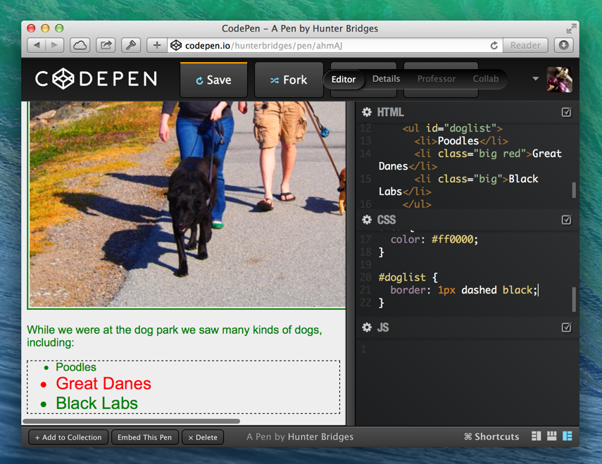
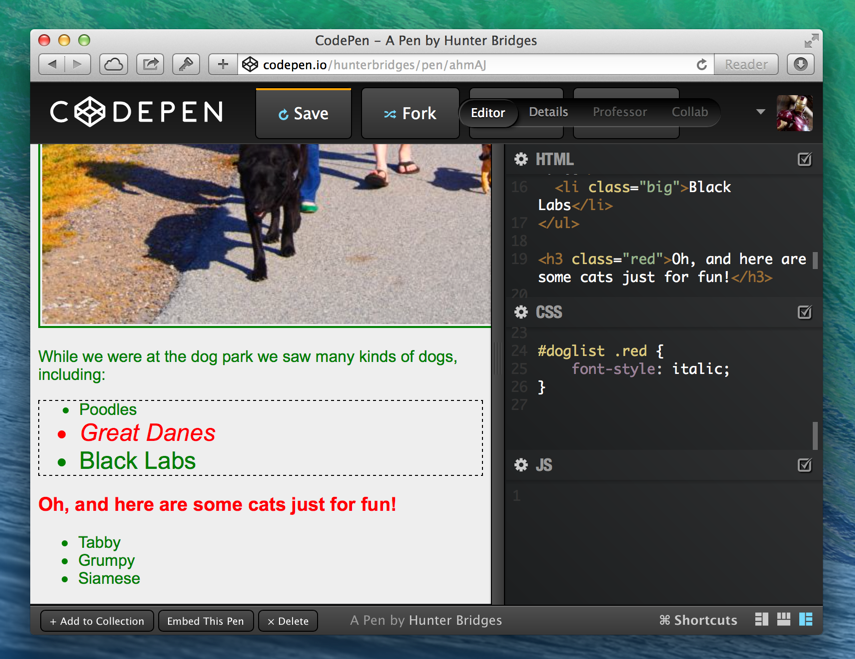
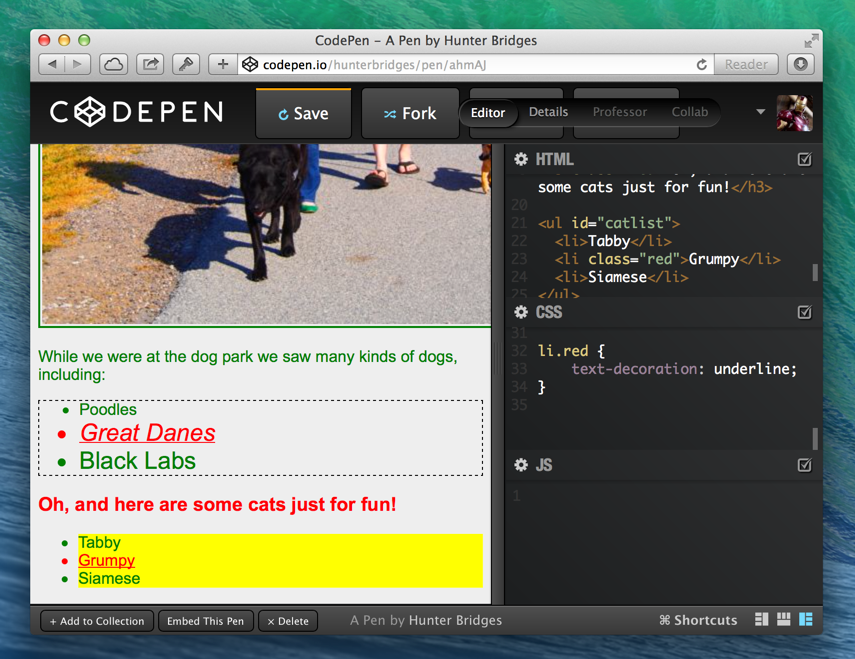
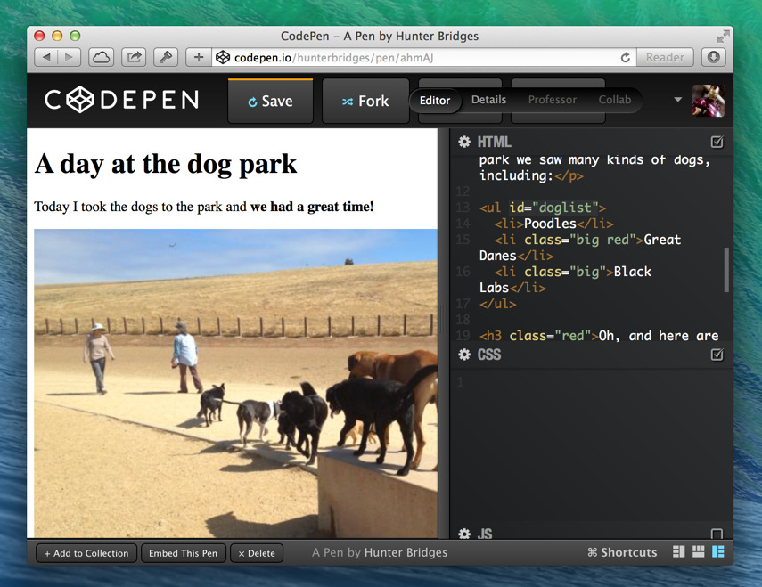
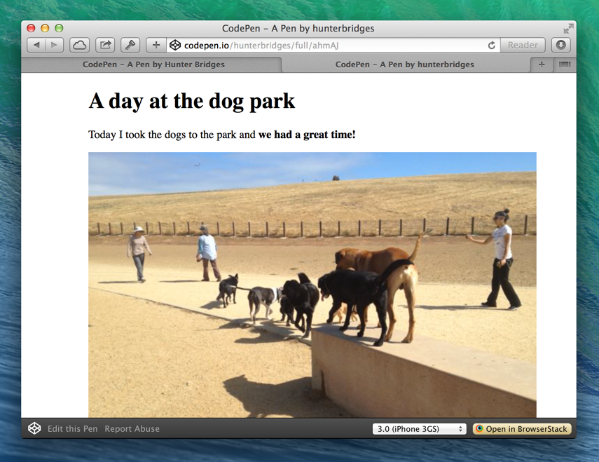
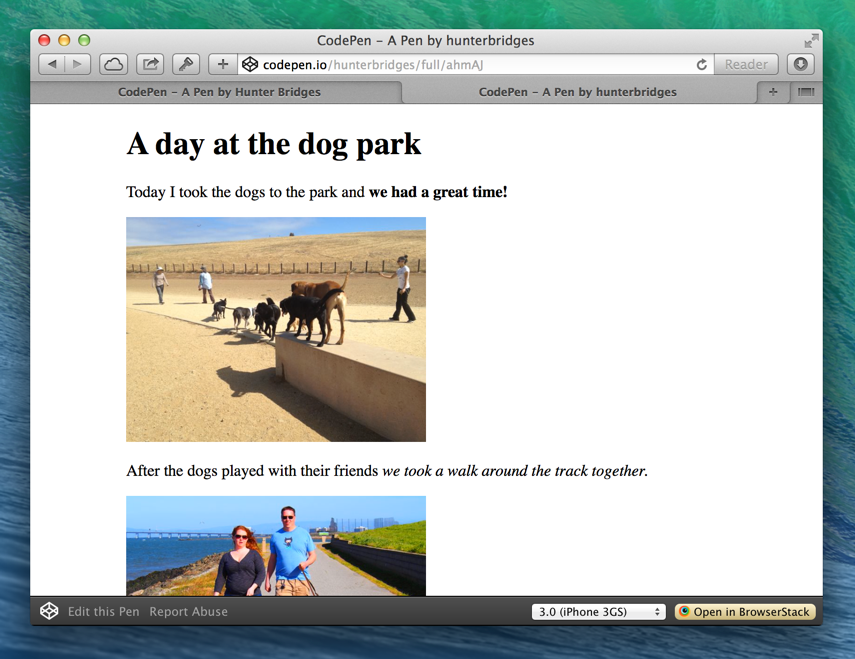
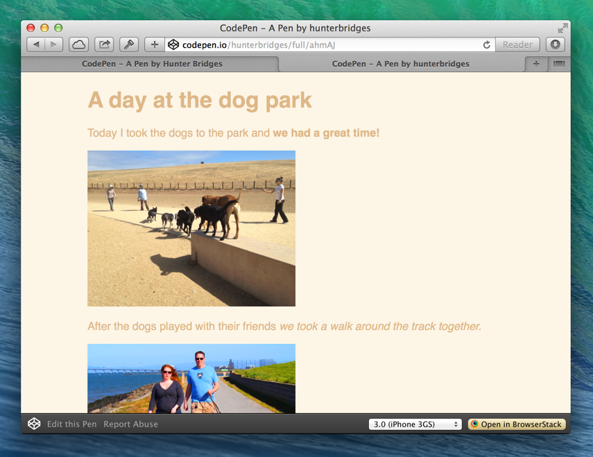
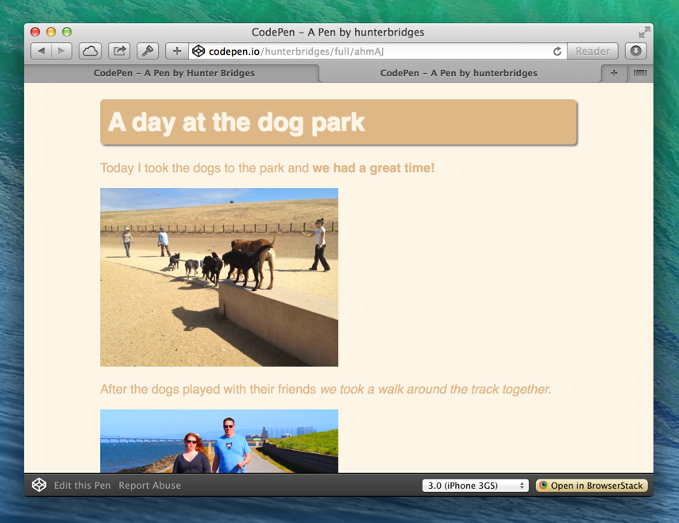
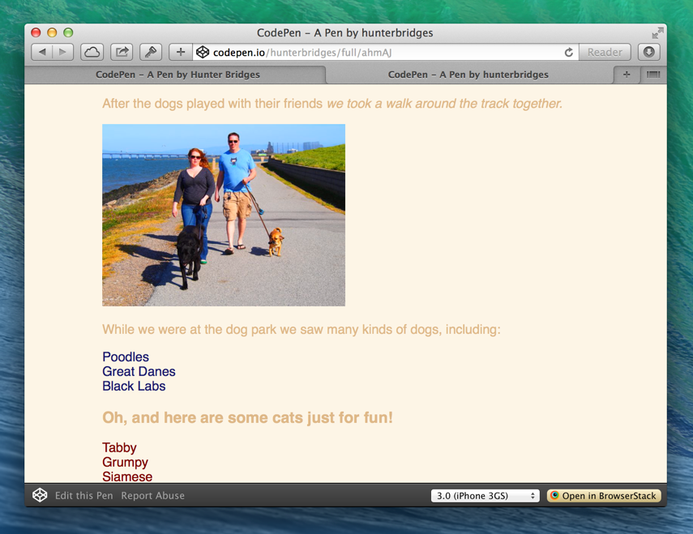
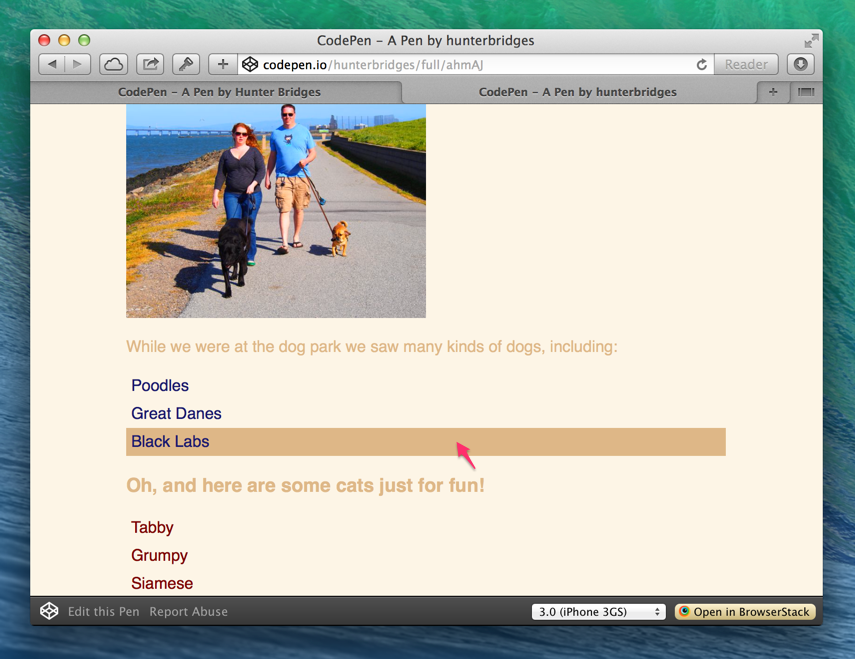

# Build a web page, Lesson 2 – CSS

## Overview

Today's lesson is about
[Cascading Style Sheets](http://en.wikipedia.org/wiki/CSS),
more commonly known as CSS. We are going to use CSS to improve the _look
and feel_ of our stories.

### What is CSS?

CSS is a language that can be used to describe how HTML is supposed to look.
The important distinction here is that HTML structures the content,
while CSS controls how it looks.

Let's look at the difference. Here's the CSS from @jonmagic's story last week:

```css
body {
  font-family: Arial;
  background-color: #eee;
  color: green;
}

img {
  border: 2px solid green;
  padding: 2px;
}
```

And the HTML:

```html
<!DOCTYPE html>
<html>
  <head>
    <title>A day at the dog park</title>
  </head>
  <body>
    <h1>A day at the dog park</h1>
    <p>Today I took the dogs to the park and <strong>we had a great time!</strong></p>
    
    <p>After the dogs played with their friends <em>we took a walk around the track together.</em></p>
    
    <p>While we were at the dog park we saw many kinds of dogs, including:</p>
    <ul>
      <li>Poodles</li>
      <li>Great Danes</li>
      <li>Black Labs</li>
    </ul>
  </body>
</html>
```

When we combine them using CodePen, we get a page that looks like this:


### How CSS Works

We can get an idea of what's happening by looking at each line of the CSS.

* For any ```<body>``` tags
    1. Use ```Arial``` as the font
    2. Set the background color to ```#eee``` (A ***hex color***)
    3. Set the foreground color to ```green```
* For any `````` tags
    1. Give it a ```2px``` wide, ```solid``` border and color it ```green```
    2. Give it ```2px``` of ***padding***

> ***hex color*** - A way to describe colors using
> [hex code](http://en.wikipedia.org/wiki/Hexadecimal). This is used a lot in
> CSS because it allows more specific color selection than just ```blue``` or
> ```green```. A hex color mixes red, green, and blue components. In CSS code,
> a hex color looks kind of like ```#RRGGBB``` or ```#RGB```. Using CodePen,
> we can press Alt to bring up a color picker that can help us find hex color
> codes.

Notice how we are modifying visual features with CSS. We wrote the story in
HTML, but we never mentioned ```green``` anywhere! Separating content from
presentation helps us stay focused and organized.

CSS follows a basic pattern. First, we select the HTML elements we want to
change the look of. Then, we say what aspects of their look we want to change.
Take this snippet for example:

```css
body {
  font-family: Arial;
  background-color: #eee;
  color: green;
}
```

We are selecting all ```<body>``` tags (We only have 1),
then saying we want to modify the font, background color, and foreground color.

The part that selects the tags is called the **selector**, and each modification
is called a **declaration**. A combination of a selector and any number
of declarations is called a **rule**. A CSS file can contain as many rules as
we want.

Let's break down the concepts of **selectors** and **declarations**.

## Selectors

So far we have seen selectors that find HTML elements by tag name.
CSS allows us to be much more flexible about targeting HTML elements to modify.
We can select using **classes**, **IDs**, and **parent-child relationships**.

### Classes

Every HTML tag can have a ```class``` attribute. Classes help us be more
specific than just tag names. Let's take our ```<ul>``` for example, and add
the class ```big``` to the ```<li>``` tags that represent big dogs.

```html
<ul>
  <li>Poodles</li>
  <li class="big">Great Danes</li>
  <li class="big">Black Labs</li>
</ul>
```

Now we are going to make the font bigger for the class ```big```. In our
selector, we target a class by using a period ```.``` followed by the class
name. Let's add this to our CSS file:

```css
.big {
    font-size: 24px;
}
```


Using a class, we only increased the font size for Great Danes and Black Labs!

An HTML element can also have multiple classes. Let's try adding a ```red```
class to Great Danes. We just type a space then the new class name.
Here's our new ```<ul>``` HTML:

```html
<ul>
  <li>Poodles</li>
  <li class="big red">Great Danes</li>
  <li class="big">Black Labs</li>
</ul>
```

And here's a new CSS rule for the ```red``` class:

```css
.red {
    color: #ff0000;
}
```


### IDs

An ID is useful for when we want to give an element a specific name. IDs
are meant to be unique, so we aren't supposed to have two elements with the
same ID. That's what makes an ID different from a class.

Let's say we want to give our ```<ul>``` the ID ```doglist```. We just add
the ```id``` attribute. Here's our new HTML:

```html
<ul id="doglist">
  <li>Poodles</li>
  <li class="big red">Great Danes</li>
  <li class="big">Black Labs</li>
</ul>
```

In CSS, we target an ID using a hash mark ```#``` followed by the ID. Here's
our new CSS rule:

```css
#doglist {
    border: 1px dashed black;
}
```



**Protip!** Selecting by ID is faster for the browser to process than selecting
by class or tag name. Use IDs whenever you need to style just one element!

### Parent-child relationships

Here is where things start to get interesting. We can select HTML elements
based on which elements contain them. To get set up for this example,
let's add a new ```<ul>``` after ```#doglist```:

```html
<ul id="doglist">
  <li>Poodles</li>
  <li class="big red">Great Danes</li>
  <li class="big">Black Labs</li>
</ul>

<h3 class="red">Oh, and here are some cats just for fun!</h3>

<ul id="catlist">
  <li>Tabby</li>
  <li>Grumpy</li>
  <li>Siamese</li>
</ul>
```

Here is how our page should look after we've added the new HTML:


So let's say our boss comes in and tells us we have to make all the red dogs
be italic. We can't edit our ```.red``` rule that we have already, because that
would make our ```<h3>``` tag also turn red! But what we can do is create a
selector that only targets ```.red``` elements inside of ```#doglist```, and
that will do exactly what we want.

By using a space ``` ``` in our selector, we can target HTML elements based on
the elements that contain them. To make all the ```.red``` elements inside of
```#doglist``` be italic, we would do this:

```css
#doglist .red {
    font-style: italic;
}
```



We can describe containment as deeply as we want! For example, here is a
selector for `````` tags that are inside of ```<strong>``` tags
that are inside of ```#doglist```:

```css
#doglist strong img {

}
```

### Combining them all

So now we have learned the basic building blocks of CSS selectors: tag names,
classes, IDs, and containment. Let's explore how we can combine these concepts
to be even more specific!

Let's add the ```red``` class to Grumpy Cat:

```html
  <li class="red">Grumpy</li>
```

Let's add a rule to make all ```<li>``` tags in ```#catlist``` have a
```yellow``` background. That will really bring them to life.

```css
#catlist li {
    background-color: yellow;
}
```

Let's also add a rule to make all ```<li>``` tags with the ```.red``` class
be underlined.

```css
li.red {
    text-decoration: underline;
}
```



Notice how even though the ```<h3>``` is of the class ```.red```, it doesn't
get underlined because we combined the class with the tag name in the selector.

## Declarations

I have some good news for you... Selectors were the hard part, and declarations
are the fun part! Declarations are the style modifications we apply in each
CSS rule. There are two parts to each declaration: the **property** and the
**value**. The pattern is:

```property: value;```

### Properties

The properties we are able to modify with CSS are set by the web browser. A list
of most common ones can be found [here](http://www.w3schools.com/cssref/). A few
examples of CSS properties we have already seen are ```background-color```,
```font-family```, ```border```, and ```text-decoration```.

### Values

The values we can use are determined by the properties. For example, the
```width``` property can accept a size, and the ```background-color``` property
can accept a color. It wouldn't make much sense to say ```width: red;``` or
```background-color: 100px;``` would it? Check a
[reference guide](http://www.w3schools.com/cssref/) for help finding out which
values can go with which properties.

## CSS Rules in the Real World

Up until now, we've only seen rules with few declarations. When we seriously
start styling, we are going to deal with some lengthy CSS rules! But the payoff
is, we can start putting all these pieces together to make things look really
cool.

Let's wipe our CSS clean. It's time for a redesign.



 I'm just going to throw
some new properties at you! Play around with them and see if you can figure
out what they do. Remember you can look all these properties up in the
[reference guide](http://www.w3schools.com/cssref/)!

We're going to make our web page 600px wide. And I'm really not digging the
Times New Roman. Every font expert knows Helvetica is the best font. And if the
computer doesn't have that, well I guess Arial is ok!


```css
body {
    width: 600px;
    margin: auto;
    font-family: Helvetica, Arial;
}
```



Those ``````s are looking a bit large!

```css
img {
    width: 50%;
}
```



Let's give it a dash of color.

```css
html {
    background-color: oldlace;
    color: burlywood;
}
```



That header needs a bit of more personality.
```css
h1 {
    background-color: burlywood;
    color: oldlace;
    padding:10px;
    border-radius: 5px;
    box-shadow: 2px 2px 2px gray;
    text-shadow: -1px -1px 1px white;
}
```



Let's scroll to the bottom. I want the text color of the ```<li>```s in
```#doglist``` to be ```midnightblue```, the text color of the ```<li>```s in
```#catlist``` to be ```maroon```, and I want to remove the default
list styling.

```css
ul {
    list-style: none;
    margin: 0;
    padding: 0;
}

ul#doglist li {
    color: midnightblue;
}

ul#catlist li {
    color: maroon;
}
```



Let's add a cool effect when you hover an ```<li>```!

```css
li {
    transition: background-color 0.5s;
    padding:5px;
}

li:hover {
    background-color: burlywood;
}
```



Here's a copy of the finished product on my CodePen!
[http://codepen.io/hunterbridges/pen/ahmAJ](http://codepen.io/hunterbridges/pen/ahmAJ)

## Next Lesson

Next week, we are going to look more deeply into the layout system and start
understanding how to arrange our pages in more dynamic ways! We're also
going to start looking at some common design patterns, and we'll learn how to
plan the layout of our page.
